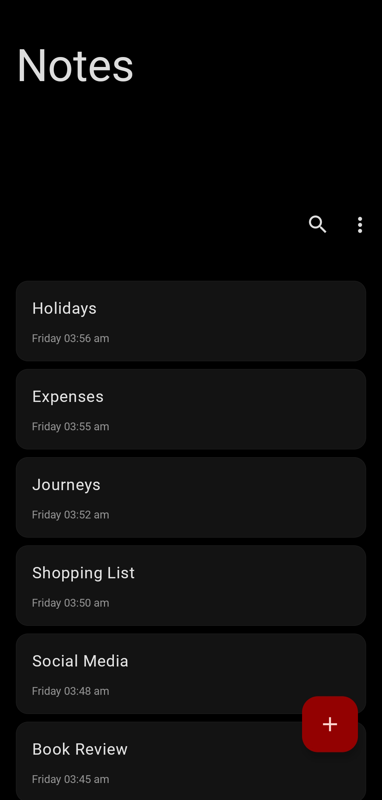
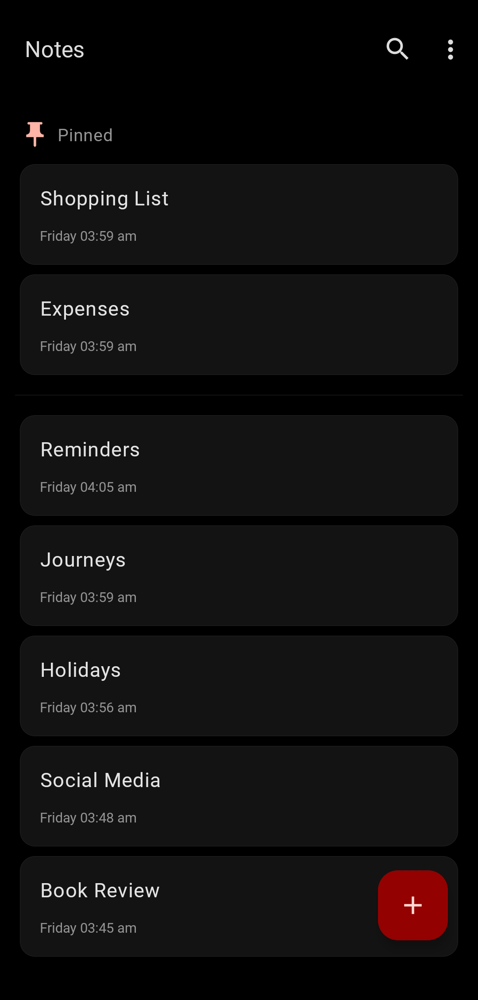
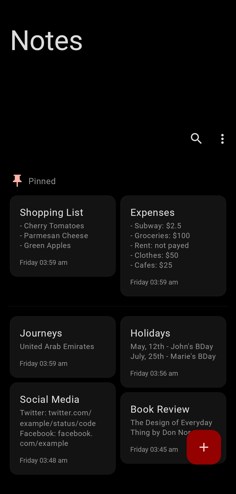
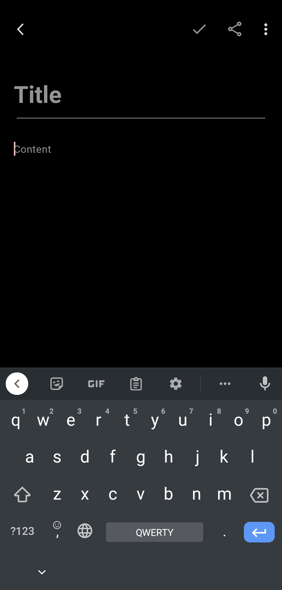
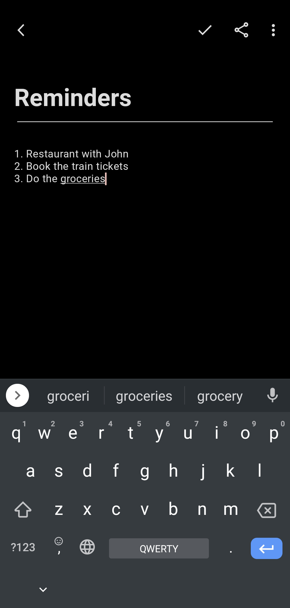
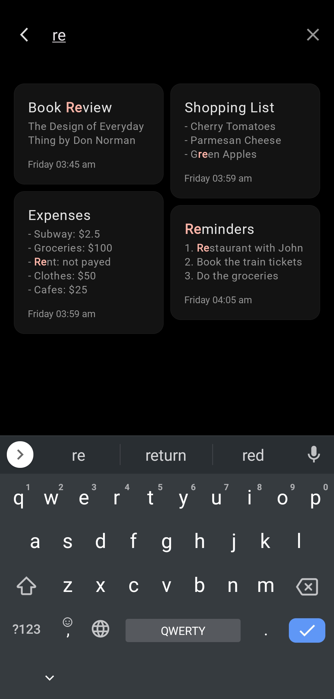
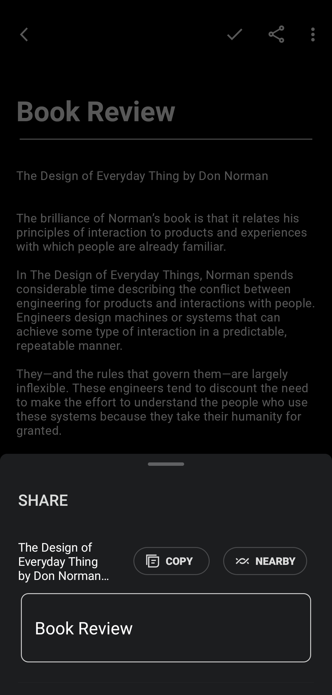

<div>
  
  <h1 style="margin-top: 0">Notes</h1>
</div>

Notes is a sample Android application for creating, storing and prioritizing notes. Being a network-
independent solution, Notes allows to store multiple note records, perform pattern searching, and 
emphasizing notes via pinning options.


## Screenshots

<div style="width: 800px">
  <div align="center">
    
    
    
  </div>
  <div>
    
    
    
    
  </div>
</div>


## Technologies & Approaches

- [**Java**](https://docs.oracle.com/en/java)
  as programming language
    - [**Java.Time**](https://docs.oracle.com/javase/8/docs/api/java/time/package-summary.html)
      for date & time manipulations
- [**RxJava 3**](https://github.com/ReactiveX/RxJava)
  as asynchronous and multithreading operations framework
    - [**LiveDataReactiveStreams**](https://developer.android.com/reference/androidx/lifecycle/LiveDataReactiveStreams)
      for LiveData integration
- [**Dagger 2**](https://dagger.dev/dev-guide)
  for dependency injection
- [**XML**](https://developer.android.com/develop/ui/views/layout/declaring-layout)
  for building user interface layouts
    - [**Material Design 3**](https://m3.material.io)
      as user interface design toolkit
    - [**ViewBinding**](https://developer.android.com/topic/libraries/view-binding)
      for accessing .xml view hierarchy
    - [**JakeWharton RxBinding**](https://github.com/JakeWharton/RxBinding)
      for observing view events with RxJava
- **Single Activity Architecture**
  for user interface structuring
    - [**Fragments**](https://developer.android.com/guide/fragments)
      for managing user interface destinations
- [**androidx.Lifecycle**](https://developer.android.com/topic/libraries/architecture/lifecycle)
  for implementing **Model-View-ViewModel** pattern
  - **LiveData** as lifecycle-aware data holder
- [**Fragment Manager**](https://developer.android.com/guide/fragments/fragmentmanager)
  for navigation
- [**Room**](https://developer.android.com/training/data-storage/room)
  for deploying & managing local database
  - [**Room RxJava**](https://developer.android.com/jetpack/androidx/releases/room)
  for RxJava 3 support
- [**Shared Preferences**](https://developer.android.com/training/data-storage/shared-preferences)
  as key-value pairs storage
- [**Gradle Groovy**](https://developer.android.com/build#build-files)
  for managing build configurations


## Unique Features

**i.e. what is unique among other samples?**

- **Java** as programming language
- **RxJava** as asynchronous and multithreading operations framework
- **CollapsingToolbarLayout** for expanding the 
  [**scrollable notes list**](https://github.com/rskopyl/Notes/blob/main/app/src/main/res/layout/fragment_home.xml)
- **StaggeredGridLayoutManager** for implementing the 
  [**grid rendering mode**](https://github.com/rskopyl/Notes/blob/main/app/src/main/java/com/rskopyl/notes/ui/home/HomeFragment.java)
- **Dagger MultiBinding** for providing 
  [**ViewModel-s as dependencies**](https://github.com/rskopyl/Notes/blob/main/app/src/main/java/com/rskopyl/notes/di/ViewModelModule.java)
- **Groovy** for managing project & module 
  [**build configurations**](https://github.com/rskopyl/Notes/blob/main/app/build.gradle)


##  License

```
MIT License

Copyright (c) 2023 Rostyslav Kopyl

Permission is hereby granted, free of charge, to any person obtaining a copy
of this software and associated documentation files (the "Software"), to deal
in the Software without restriction, including without limitation the rights
to use, copy, modify, merge, publish, distribute, sublicense, and/or sell
copies of the Software, and to permit persons to whom the Software is
furnished to do so, subject to the following conditions:

The above copyright notice and this permission notice shall be included in all
copies or substantial portions of the Software.

THE SOFTWARE IS PROVIDED "AS IS", WITHOUT WARRANTY OF ANY KIND, EXPRESS OR
IMPLIED, INCLUDING BUT NOT LIMITED TO THE WARRANTIES OF MERCHANTABILITY,
FITNESS FOR A PARTICULAR PURPOSE AND NONINFRINGEMENT. IN NO EVENT SHALL THE
AUTHORS OR COPYRIGHT HOLDERS BE LIABLE FOR ANY CLAIM, DAMAGES OR OTHER
LIABILITY, WHETHER IN AN ACTION OF CONTRACT, TORT OR OTHERWISE, ARISING FROM,
OUT OF OR IN CONNECTION WITH THE SOFTWARE OR THE USE OR OTHER DEALINGS IN THE
SOFTWARE.
```